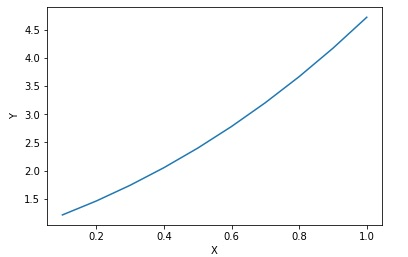

# Taller-Ecuaciones-Diferenciales
Taller 04/05/2018

#### Obtenga diez puntos de la solución de la ecuación, utilizando el método de Taylor (los tres primeros términos)con h=0.1
                                dy/dx - (x+y) = 1-x^2 ; y(0)= 1  

Se implemento el método de Taylor en python, resultando en el siguiente codigo :   

```python
# -*- coding: utf-8 -*-
"""
Created on Fri May  4 07:26:25 2018

@author: Juan David Orozco
"""
from pylab import *
from sympy import *
import matplotlib.pyplot as plt

x,y = symbols('x,y')
def derivada(f,k):
    t = f
    for j in range(1,k+1):
        d = diff(f.subs(y,y(x)),x)
        f=d.subs(Derivative(y(x),x),(t)).subs(y(x),y)
    return f

def taylor (f,a,b,h,m,k):
    D = []
    for j in range(1,k+1):    
        D= D+[derivada(f,j)]
    v=[]
    v1=[]
    for i in range(m):
        g = f.subs(x,a).subs(y,b)
        t = b+h*g
        for j in range (1,k+1):
            z=D[j-1].subs(x,a).subs(y,b)
            t=float(t+h**(j+1)/factorial(j+1)*z)    #evaluamos la expresion
        b = t
        a = a+h
        v = v+[a]
        v1 = v1+[b]
    return [v,v1]

f = y-x**2+x+1
[v,v1]=taylor(f,0,1,0.1,10,3)
print (v)
print ('\n')
print (v1)

plt.plot(v,v1)
plt.ylabel('Y')
plt.xlabel('X')
plt.show()


```  
El error de truncamiento al ser 10 puntos en cada paso será O(h<sup>10</sup>)  


Se obtuvierón los siguientes datos para 10 iteraciones, redondeado a 6 decimales:  

|    x              |       y         | 
|-------------------|-----------------|
|   0.1             | 1.215170        |
|   0.2             | 1.461403        |
|   0.3             | 1.739858        |
|   0.4             | 2.051824        |
|   0.5             | 2.398720        |
|   0.6             | 2.782118        |
|   0.7             | 3.203752        |
|   0.8             | 3.665539        |
|   0.9             | 4.169601        |
|   0.999999        | 4.718279        |

El error de truncamiento de este resultado es 10<sup>-6</sup>

Gráfica


                                

                                


